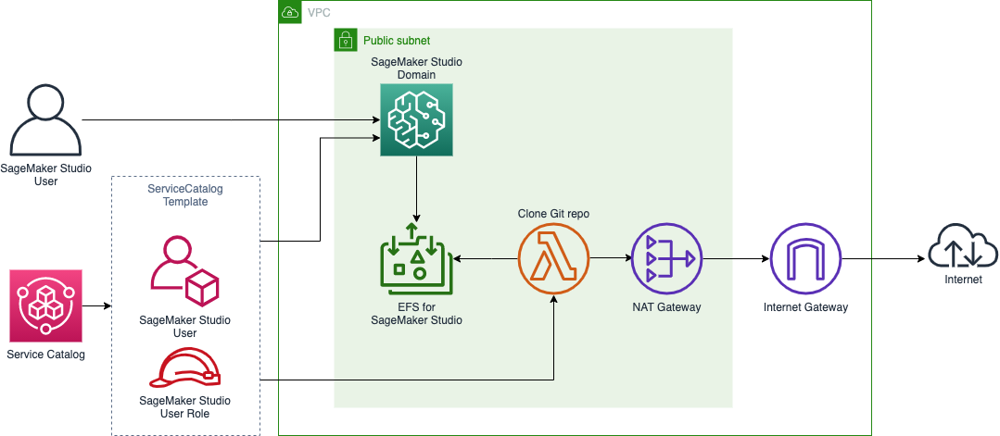

# Template for deploying SageMaker Studio within a Public VPC

This template is written using `CDK`, and can be synthesised into a CloudFormation template using

```terminal
~$ cdk synth
```

## High level architecture

This template deploys an Amazon SageMaker Studio Domain in the a public subnet account and region provided to CDK. It also creates a Service Catalog Template designed to

- initialize a SageMaker Studio User (IAM authentication)
- corresponding SageMaker Studio User roles
- Trigger a Lambda Function that clones the indicated Git repository into the user home folder




## ToDo

- Add internal PyPi registry
- Move domain to private subnet
- Setup services VPC endpoints
